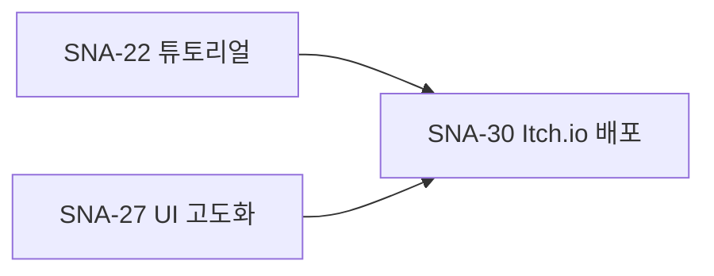

# 📊 Phase 2 진행 상황

## 이슈 상태 요약 (2026-03-01)

### Phase 1: 완료 ✅

| 이슈 | 제목 | 상태 |
|------|------|------|
| SNA-5 | 개발 환경 세팅 (Godot 4.6.1) | ✅ Done |
| SNA-6 | Hello World 빌드 (Win/Mac/Linux) | ✅ Done |
| SNA-7 | 데이터 로드 시스템 (JSON → Resource) | ✅ Done |
| SNA-8 | 세이브/로드 시스템 기본 | ✅ Done |
| SNA-9 | 기본 UI 프레임워크 | ✅ Done |
| SNA-10 | 아트 스타일 가이드 | ✅ Done |
| SNA-11 | 베이커리 배경 (기본) | ✅ Done |
| SNA-12 | 파티시에 기본 스프라이트 | ✅ Done |
| SNA-13 | 빵 아이콘 5종 | ✅ Done |
| SNA-14 | UI 키트 기본 | ✅ Done |
| SNA-15 | BGM 1곡 (메인 테마) | ✅ Done |
| SNA-16 | 핵심 데이터 시트 완성 | ✅ Done |
| SNA-17 | 프로토타입 범위 확정 | ✅ Done |
| SNA-18 | 레시피/빵 데이터 시트 | ✅ Done |
| SNA-19 | 요정 파티시에 설계 | ✅ Done |
| SNA-20 | 일일 퀘스트 설계 | ✅ Done |
| SNA-21 | UX 플로우차트 | ✅ Done |

---

### Phase 2: 진행 중

| 이슈 | 제목 | 상태 | 비고 |
|------|------|------|------|
| SNA-23 | 밸런싱 시트 - 생산 속도, 가격 곡선 | ✅ Done | data/balance.json |
| SNA-24 | 업적/도감 설계 - 수집 요소 | ✅ Done | data/achievements.json, collection.json |
| SNA-25 | 요정 파티시에 스프라이트 | ✅ Done | 3종 (딸기, 초코, 민트) |
| SNA-26 | 추가 빵 스프라이트 | ✅ Done | 7종 (계절/특수 빵) |
| SNA-28 | 핵심 루프 구현 - 생산/성장 시스템 | ✅ Done | TDD + 28 tests |
| SNA-29 | 프로토타입 플레이 가능 | ✅ Done | E2E 시나리오 작성 완료 |
| SNA-33 | 테스트 계획 - 유닛/E2E 테스트 | ✅ Done | docs/E2E_SCENARIOS.md |
| SNA-22 | 튜토리얼 스크립트 | 📋 Backlog | blocked by SNA-29 (해제됨) |
| SNA-27 | UI 고도화 - 애니메이션, 트랜지션 | 📋 Backlog | blocked by SNA-29 (해제됨) |
| SNA-30 | Itch.io 페이지 - 프로토타입 공개 | 📋 Backlog | blocked by SNA-22, SNA-27 |
| SNA-32 | API 문서 - 내부 함수 명세 | 📋 Backlog | 작성 필요 |

---

### Phase 3: 계획됨

| 이슈 | 제목 | 상태 | 비고 |
|------|------|------|------|
| SNA-31 | 배달 시스템 기획 - 추가 기능 | 📋 Backlog | Phase 3+ |
| SNA-34 | 알파 테스트 계획 | 📋 Backlog | Phase 3 |
| SNA-35 | 알파 빌드 완성 | 📋 Backlog | Phase 3 |
| SNA-36 | Steam 스토어 페이지 | 📋 Backlog | Phase 4 |
| SNA-37 | 트레일러 영상 | 📋 Backlog | Phase 4 |
| SNA-38 | 프레스 키트 | 📋 Backlog | Phase 4 |
| SNA-39 | 정식 출시 - Steam/Itch.io | 📋 Backlog | Phase 4 |

---

## 📁 완성된 문서

| 문서 | 경로 | 이슈 | 상태 |
|------|------|------|------|
| GDD | docs/GDD.md | SNA-17 | ✅ |
| 밸런싱 시트 | data/balance.json | SNA-23 | ✅ |
| 업적 설계 | data/achievements.json | SNA-24 | ✅ |
| 도감 설계 | data/collection.json | SNA-24 | ✅ |
| E2E 시나리오 | docs/E2E_SCENARIOS.md | SNA-33 | ✅ |
| QA Check 스킬 | skills/qa-check/ | - | ✅ |

---

## 📋 다음 단계

### 즉시 작업 가능 (Block 해제됨)

1. **SNA-22: 튜토리얼 스크립트**
   - E2E-01 시나리오 기반
   - 첫 실행 가이드 작성

2. **SNA-27: UI 고도화**
   - 애니메이션 추가
   - 트랜지션 효과

3. **SNA-32: API 문서**
   - 내부 함수 명세
   - autoload 매니저 문서화

### 우선순위

---

## 🧪 테스트 현황

| 항목 | 수치 |
|------|------|
| 테스트 파일 | 19개 |
| 테스트 케이스 | 209개 |
| 통과율 | 100% |
| 커버리지 | 68% (11/16) |

---

## 📊 마일스톤 진행

| 마일스톤 | 목표 | 상태 |
|----------|------|------|
| 5분 | 첫 빵 판매 (100골드) | ✅ 테스트 완료 |
| 30분 | 요정 1명 고용 | ✅ 테스트 완료 |
| 1시간 | 두 번째 빵 해금 | ✅ 테스트 완료 |
| 1일 | 기본 업그레이드 완료 | ✅ 테스트 완료 |
| 1주일 | 모든 기본 빵 해금 | 📋 테스트 대기 |

---

## 🔄 업데이트 로그

### 2026-03-01

- SNA-29: Done으로 변경 (프로토타입 E2E 시나리오 완성)
- SNA-33: Done으로 변경 (E2E 테스트 시나리오 작성)
- docs/PHASE2_STATUS.md 생성
